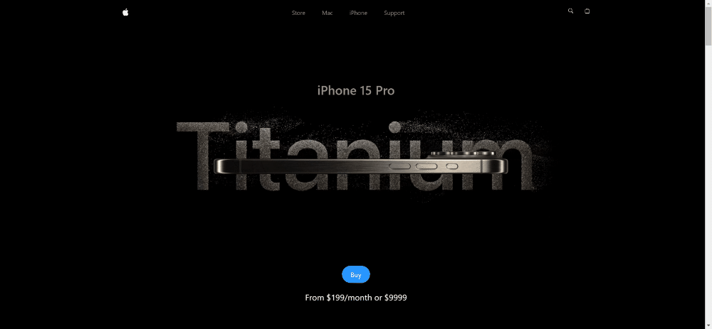
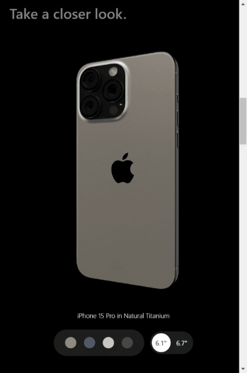

   
    
   
  

# iPhone 15 Landing Page Clone

## Features

- **📱Responsive Design**: Adaptable interface for a consistent experience across different devices.

- **💫GSAP Animations**: Smooth and engaging animations that mimic the original iPhone 15 landing page. 

- **🌐Three.js**: 3D model of the iPhone 15 Pro, color and size selector.

## Web Preview

### Hero Section

 

### Higlights, Video Carousel

### 3D Model, Color and Size Selector

## Fluid Animations

## 🛠️Built With

- [React](https://reactjs.org/) - Frontend framework
- [Tailwind CSS](https://tailwindcss.com/) - For styling and responsive design
- [GSAP](https://greensock.com/gsap/) - For animations
- [Three.js](https://threejs.org/) - For 3D model and color/size selector

